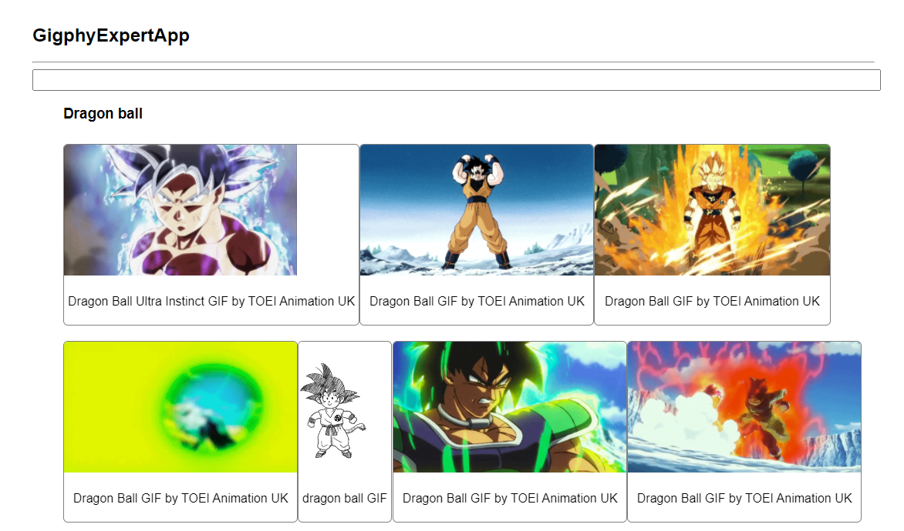

# Gigphy-Expert-App

webApp de practica que conecta con endpoints de Giphy para hacer busquedas de gifs animados. Basado en el curso de Fernando Herrera - React: De cero a experto ( Hooks y MERN )

### Librerías utilizadas
- Node 17
- React 17
- animate.css
- wojtekmaj / enzyme-adapter-react-17
- enzyme-to-json
- react-hooks-testing-library

### Instrucciones.
Para instalar y ejecutar.
```
npm install
npm install --save-dev @wojtekmaj/enzyme-adapter-react-17
npm start
```

### Enlaces de interes:
https://github.com/wojtekmaj/enzyme-adapter-react-17
https://www.npmjs.com/package/enzyme-to-json
https://react-hooks-testing-library.com/



<hr/>
<h3>¡Sigueme en mis redes!</h3>

  [](https://github.com/wotanCode)
  [](https://github.com/wotanCode)
  [](https://www.youtube.com/@wotancode640)
  [](https://www.linkedin.com/in/pedro-yanez/)
  [](https://www.instagram.com/pedroelhumano/?theme=dark)
  [](https://www.twitter.com/pedroelhumano)
