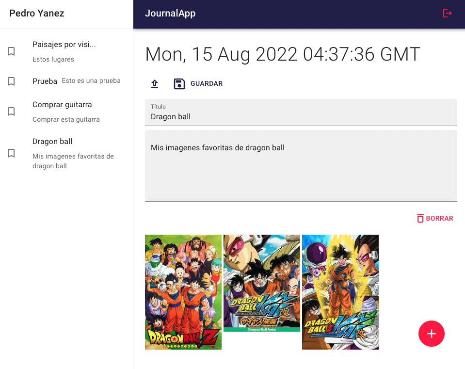

# Journal-App
Journal app es una aplicación de estilo diario, basado en el curso de Fernando Herrera.

[

## Tecnologias utilizadas
```
- React
- Firebase
- Cloudinary
```

## Requisitos
- node 14.19.2
- npm 8.9.0

## RUN
- npm install
- npm run dev

